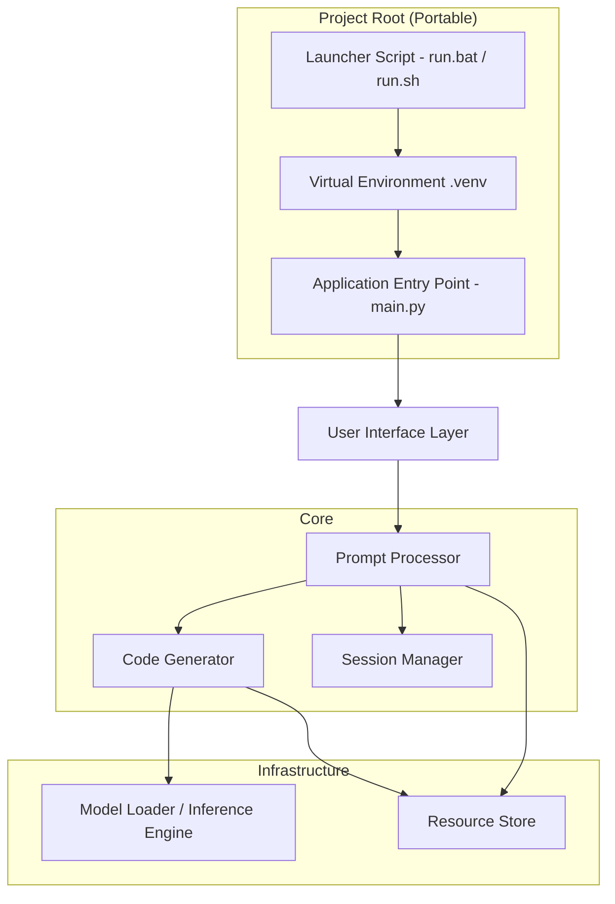
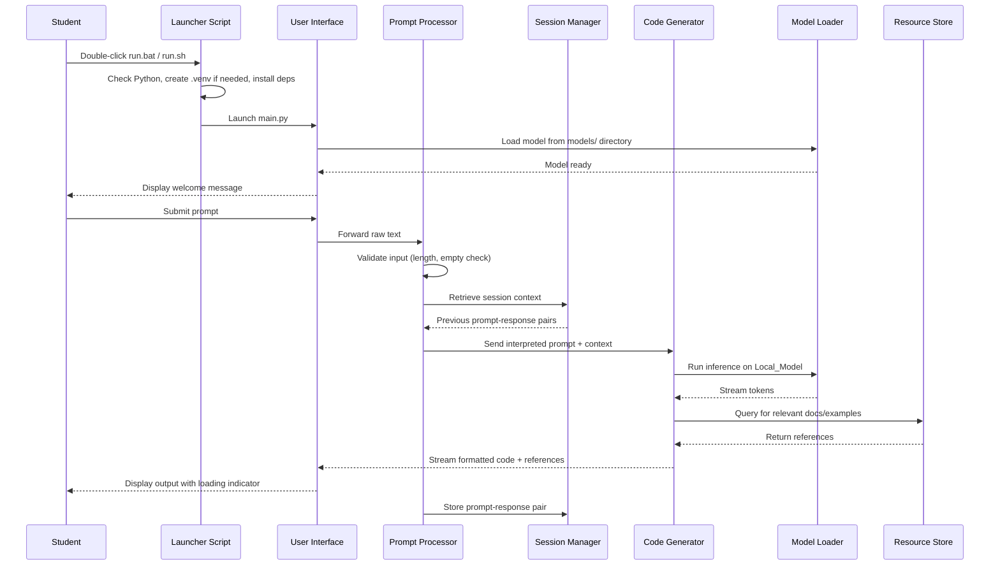

# Design Document: Offline Coding AI Assistant

## Overview

This document describes the technical design for an offline Python coding AI assistant targeted at students. The system runs entirely on local hardware, accepting natural language prompts and generating Python code using a locally stored language model. It provides a conversational, session-based experience with access to offline documentation and code examples.

The application is a Python-based desktop tool with a text-based UI (terminal or simple GUI), a local inference engine backed by a quantized LLM (e.g., via llama.cpp or similar), and a local resource store for documentation and examples.

### Key Design Decisions

- **Zero-Docker, fully portable design**: The entire application is designed to run without Docker or any containerization. A student receives the project folder (e.g., via USB drive, zip download, or file share) and runs a single launcher script. No complex installation, no Docker, no cloud services.
- **Copy-and-run philosophy**: All paths are relative to the project root. The project directory is entirely self-contained — it can be moved, copied, or renamed and still work. No absolute paths or system-wide installations are assumed.
- **Launcher scripts for zero-friction startup**: Platform-specific launcher scripts (`run.bat` for Windows, `run.sh` for macOS/Linux) handle virtual environment creation, dependency installation, and application launch in a single step. Students run one command.
- **Bundled virtual environment**: The launcher creates a local `.venv` inside the project directory on first run. All Python dependencies are installed there, isolated from the system Python. On subsequent runs, it reuses the existing `.venv`.
- **Single prerequisite: Python 3.10+**: The only requirement is a system Python installation (3.10 or later). The launcher script checks for this and provides a clear error message if not found. For advanced distribution, an embedded Python interpreter can optionally be bundled in the project directory (see Portable Python section below).
- **Python as implementation language**: Matches the target output language and is familiar to the student audience.
- **llama-cpp-python for local inference**: Provides efficient CPU/GPU inference for quantized GGUF models without internet dependency. Installed via pip into the local `.venv`.
- **Terminal-based UI (Rich/Textual)**: Lightweight, cross-platform, and simple for students. Avoids heavy GUI framework dependencies.
- **SQLite for session context**: Lightweight, file-based storage for conversation history within sessions. Database file stored inside the project directory.
- **Markdown-based resource store**: Offline docs and examples stored as structured markdown files, indexed for fast lookup.
- **GGUF model in project directory**: The model file is expected at a relative path (`models/` directory) within the project root. No external model registry or download step during runtime.

## Architecture

The system follows a layered architecture with clear separation of concerns. All components resolve paths relative to the project root directory.



### Project Directory Structure

The entire application is self-contained within a single directory:

```
offline-coding-ai/
├── run.bat                  # Windows launcher (double-click to start)
├── run.sh                   # macOS/Linux launcher (./run.sh to start)
├── setup_check.py           # Pre-flight check script (Python version, deps)
├── main.py                  # Application entry point
├── requirements.txt         # Python dependencies (pinned versions)
├── config.json              # Application configuration (relative paths only)
├── src/
│   ├── __init__.py
│   ├── ui.py
│   ├── prompt_processor.py
│   ├── code_generator.py
│   ├── model_loader.py
│   ├── session_manager.py
│   └── resource_store.py
├── models/
│   └── codellama-7b-instruct.Q4_K_M.gguf   # Local GGUF model file
├── resources/
│   ├── docs/
│   │   ├── stdlib/
│   │   │   ├── os.md
│   │   │   ├── sys.md
│   │   │   ├── json.md
│   │   │   └── ...
│   │   └── index.json
│   └── examples/
│       ├── loops.md
│       ├── file_io.md
│       ├── classes.md
│       └── ...
├── data/                    # Runtime data (created automatically)
│   └── sessions.db          # SQLite session database
├── logs/                    # Application logs (created automatically)
│   └── app.log
└── .venv/                   # Virtual environment (created by launcher)
```

### Launcher Scripts

The launcher scripts are the primary entry point for students. They handle all setup automatically.

**`run.bat` (Windows):**
```batch
@echo off
echo ============================================
echo   Offline Coding AI Assistant - Starting...
echo ============================================

REM Determine project root from script location
set "PROJECT_ROOT=%~dp0"
cd /d "%PROJECT_ROOT%"

REM Check for Python
where python >nul 2>nul
if %errorlevel% neq 0 (
    echo [ERROR] Python is not installed or not in PATH.
    echo Please install Python 3.10 or later from https://www.python.org/downloads/
    echo Make sure to check "Add Python to PATH" during installation.
    pause
    exit /b 1
)

REM Check Python version
python -c "import sys; exit(0 if sys.version_info >= (3, 10) else 1)"
if %errorlevel% neq 0 (
    echo [ERROR] Python 3.10 or later is required.
    python --version
    pause
    exit /b 1
)

REM Create virtual environment if it doesn't exist
if not exist ".venv" (
    echo Creating virtual environment...
    python -m venv .venv
)

REM Activate and install dependencies
call .venv\Scripts\activate.bat
pip install -q -r requirements.txt

REM Launch the application
echo Starting the assistant...
python main.py
pause
```

**`run.sh` (macOS/Linux):**
```bash
#!/usr/bin/env bash
set -e

echo "============================================"
echo "  Offline Coding AI Assistant - Starting..."
echo "============================================"

# Determine project root from script location
PROJECT_ROOT="$(cd "$(dirname "$0")" && pwd)"
cd "$PROJECT_ROOT"

# Check for Python 3.10+
PYTHON=""
for cmd in python3 python; do
    if command -v "$cmd" &>/dev/null; then
        if "$cmd" -c "import sys; exit(0 if sys.version_info >= (3, 10) else 1)" 2>/dev/null; then
            PYTHON="$cmd"
            break
        fi
    fi
done

if [ -z "$PYTHON" ]; then
    echo "[ERROR] Python 3.10 or later is required."
    echo "Install it from https://www.python.org/downloads/"
    exit 1
fi

# Create virtual environment if it doesn't exist
if [ ! -d ".venv" ]; then
    echo "Creating virtual environment..."
    "$PYTHON" -m venv .venv
fi

# Activate and install dependencies
source .venv/bin/activate
pip install -q -r requirements.txt

# Launch the application
echo "Starting the assistant..."
python main.py
```

### Portable Python Option (Advanced)

For maximum portability (students don't even need Python pre-installed), the project can optionally bundle an embedded Python interpreter:

```
offline-coding-ai/
├── python-embedded/          # Optional: embedded Python 3.10+ (Windows)
│   ├── python.exe
│   ├── python310.dll
│   └── ...
├── run.bat                   # Detects embedded Python first, falls back to system
└── ...
```

The launcher script checks for `python-embedded/python.exe` first. If present, it uses that. Otherwise, it falls back to the system Python. This approach adds ~30MB to the distribution but eliminates the Python prerequisite entirely on Windows. On Linux/macOS, Python is typically pre-installed or easily available via package managers.

### Component Flow



## Components and Interfaces

### Path Resolution Utility (`path_utils.py`)

All components use a shared utility to resolve paths relative to the project root. This ensures portability regardless of where the project directory is located.

```python
import os

def get_project_root() -> str:
    """Return the absolute path to the project root directory.
    Determined from the location of this file, not the current working directory."""
    return os.path.dirname(os.path.dirname(os.path.abspath(__file__)))

def resolve_path(*parts: str) -> str:
    """Resolve a path relative to the project root.
    Example: resolve_path('models', 'codellama.gguf') -> '/abs/path/to/project/models/codellama.gguf'
    """
    return os.path.join(get_project_root(), *parts)
```

### 1. User Interface (`ui.py`)

Provides the text-based interaction layer using the Rich library for terminal rendering.

```python
class UserInterface:
    def start_session() -> None
        """Launch the UI, display welcome message, enter input loop."""

    def display_welcome() -> None
        """Show welcome message with usage instructions."""

    def get_prompt() -> str
        """Read user input from the text input area."""

    def display_output(code: str, references: list[str]) -> None
        """Render generated code in a separated, scrollable output area."""

    def display_loading() -> None
        """Show a loading/spinner indicator during generation."""

    def display_error(message: str) -> None
        """Show error messages to the student."""

    def copy_to_clipboard(text: str) -> None
        """Copy the given text to the system clipboard."""
```

### 2. Prompt Processor (`prompt_processor.py`)

Validates, interprets, and contextualizes user prompts.

```python
class PromptProcessor:
    MAX_PROMPT_LENGTH: int = 2000

    def validate(prompt: str) -> ValidationResult
        """Check prompt is non-empty and within character limit. Returns ValidationResult with status and error message."""

    def build_context(prompt: str, session_history: list[dict]) -> str
        """Combine current prompt with session history into a contextualized prompt for the model."""

    def is_coding_request(prompt: str) -> bool
        """Determine if the prompt is interpretable as a coding request."""
```

```python
@dataclass
class ValidationResult:
    is_valid: bool
    error_message: str | None
```

### 3. Code Generator (`code_generator.py`)

Orchestrates inference and formats output.

```python
class CodeGenerator:
    def generate(prompt: str, context: str) -> Generator[str, None, None]
        """Stream Python code tokens from the model. Yields partial output as tokens become available."""

    def format_output(raw_code: str) -> str
        """Apply PEP 8 formatting and ensure inline comments are present."""

    def build_response(code: str, references: list[str]) -> str
        """Combine generated code with documentation references into final output."""
```

### 4. Model Loader (`model_loader.py`)

Handles loading and managing the local LLM. The model path is resolved relative to the project root.

```python
class ModelLoader:
    def __init__(config: AppConfig) -> None
        """Initialize with application config. Model path is resolved relative to project root."""

    def load() -> None
        """Load the Local_Model from the models/ directory.
        Raises ModelLoadError if file is missing or corrupted.
        The model path is resolved as: <project_root>/models/<model_filename>"""

    def infer(prompt: str) -> Generator[str, None, None]
        """Run inference on the loaded model, streaming tokens. Raises InferenceError on failure."""

    def get_model_info() -> dict
        """Return model name and version for logging."""
```

### 5. Session Manager (`session_manager.py`)

Manages conversation context within a session. SQLite database is stored at `<project_root>/data/sessions.db`.

```python
class SessionManager:
    MAX_CONTEXT_PAIRS: int = 10

    def __init__(config: AppConfig) -> None
        """Initialize with config. Database path resolved relative to project root."""

    def new_session() -> str
        """Create a new session with empty context. Returns session ID."""

    def add_exchange(session_id: str, prompt: str, response: str) -> None
        """Store a prompt-response pair. Evicts oldest if at MAX_CONTEXT_PAIRS."""

    def get_history(session_id: str) -> list[dict]
        """Retrieve up to 10 most recent prompt-response pairs for the session."""

    def clear_session(session_id: str) -> None
        """Clear all context for a session."""
```

### 6. Resource Store (`resource_store.py`)

Provides offline documentation and example lookup. Resource path is resolved relative to the project root.

```python
class ResourceStore:
    def __init__(config: AppConfig) -> None
        """Initialize with config. Resource path resolved relative to project root.
        Raises ResourceStoreError if path is missing."""

    def search(query: str) -> list[ResourceEntry]
        """Search for relevant documentation and examples by topic keyword matching."""

    def get_topics() -> list[str]
        """List all available topics in the resource store."""
```

```python
@dataclass
class ResourceEntry:
    topic: str
    title: str
    content: str
    entry_type: str  # "documentation" or "example"
```

## Data Models

### Configuration

All paths in the configuration are relative to the project root. They are resolved at runtime using `path_utils.resolve_path()`.

```json
{
    "model_filename": "codellama-7b-instruct.Q4_K_M.gguf",
    "model_dir": "models",
    "resource_dir": "resources",
    "data_dir": "data",
    "log_dir": "logs",
    "max_prompt_length": 2000,
    "max_context_pairs": 10,
    "response_timeout_seconds": 30
}
```

```python
@dataclass
class AppConfig:
    model_filename: str      # GGUF model filename (e.g., "codellama-7b-instruct.Q4_K_M.gguf")
    model_dir: str           # Relative path to models directory (default: "models")
    resource_dir: str        # Relative path to resources directory (default: "resources")
    data_dir: str            # Relative path to runtime data directory (default: "data")
    log_dir: str             # Relative path to log directory (default: "logs")
    max_prompt_length: int   # Default: 2000
    max_context_pairs: int   # Default: 10
    response_timeout_seconds: int  # Default: 30

    @property
    def model_path(self) -> str:
        """Full resolved path to the GGUF model file."""
        return resolve_path(self.model_dir, self.model_filename)

    @property
    def resource_path(self) -> str:
        """Full resolved path to the resource directory."""
        return resolve_path(self.resource_dir)

    @property
    def database_path(self) -> str:
        """Full resolved path to the SQLite database."""
        return resolve_path(self.data_dir, "sessions.db")

    @property
    def log_path(self) -> str:
        """Full resolved path to the log file."""
        return resolve_path(self.log_dir, "app.log")

    @classmethod
    def load(cls, config_file: str = "config.json") -> "AppConfig":
        """Load configuration from a JSON file relative to the project root."""
        path = resolve_path(config_file)
        with open(path) as f:
            data = json.load(f)
        return cls(**data)
```

### Dependencies (`requirements.txt`)

All dependencies are pure Python or provide pre-built wheels. Pinned for reproducibility.

```
llama-cpp-python>=0.2.0
rich>=13.0.0
pyperclip>=1.8.0
```

### Session Data

```python
@dataclass
class SessionData:
    session_id: str
    history: list[Exchange]
    created_at: datetime

@dataclass
class Exchange:
    prompt: str
    response: str
    timestamp: datetime
```

### Validation and Error Types

```python
@dataclass
class ValidationResult:
    is_valid: bool
    error_message: str | None

class ModelLoadError(Exception):
    """Raised when the model file is missing or corrupted."""
    file_path: str
    failure_reason: str

class InferenceError(Exception):
    """Raised when model inference fails."""
    detail: str

class ResourceStoreError(Exception):
    """Raised when the resource directory is missing."""
    expected_path: str
```


## Correctness Properties

*A property is a characteristic or behavior that should hold true across all valid executions of a system — essentially, a formal statement about what the system should do. Properties serve as the bridge between human-readable specifications and machine-verifiable correctness guarantees.*

### Property 1: Prompt validation correctness

*For any* string, the Prompt_Processor validation SHALL accept the string if and only if it is non-empty (not purely whitespace) and its length is at most 2000 characters. Empty or whitespace-only strings and strings exceeding 2000 characters SHALL be rejected.

**Validates: Requirements 2.1, 2.2, 2.3**

### Property 2: Over-limit error message contains limit and actual length

*For any* string longer than 2000 characters, the validation error message SHALL contain the character limit "2000" and the actual length of the submitted string.

**Validates: Requirements 2.4**

### Property 3: Code formatting preserves valid Python and applies PEP 8

*For any* valid Python code string, the format_output function SHALL produce output that is also valid Python (parseable by `ast.parse`) and conforms to PEP 8 indentation rules.

**Validates: Requirements 3.3**

### Property 4: Resource search returns topic-relevant entries

*For any* query string that matches a known topic keyword in the Resource_Store, all returned ResourceEntry items SHALL have a topic field that matches the queried topic.

**Validates: Requirements 5.3**

### Property 5: Session history retention with capacity limit

*For any* sequence of N prompt-response exchanges added to a session, get_history SHALL return exactly min(N, 10) entries, and those entries SHALL be the most recent min(N, 10) exchanges in chronological order.

**Validates: Requirements 7.1, 7.3**

### Property 6: Context building includes history and current prompt

*For any* session history (list of previous exchanges) and any new prompt string, the build_context output SHALL contain the text of the new prompt and the text of every prompt and response in the provided history.

**Validates: Requirements 7.2**

### Property 7: All resolved paths are relative to project root

*For any* AppConfig instance loaded from a valid config.json, the model_path, resource_path, database_path, and log_path properties SHALL all begin with the project root directory prefix and SHALL NOT contain hardcoded absolute paths from the config file.

**Validates: Requirements 1.1, 4.1**

## Error Handling

### Startup and Environment Errors

| Error Condition | Component | Behavior |
|---|---|---|
| Python not installed or version < 3.10 | Launcher script | Print clear error message with download link. Exit with non-zero code. |
| Virtual environment creation fails | Launcher script | Print error suggesting manual `python -m venv .venv`. Exit with non-zero code. |
| pip install fails (e.g., no wheel for platform) | Launcher script | Print the pip error output. Suggest checking Python version and platform compatibility. |
| config.json missing or malformed | AppConfig.load() | Raise `FileNotFoundError` or `json.JSONDecodeError` with the expected path. UI displays the error. |

### Model Loading Errors

| Error Condition | Component | Behavior |
|---|---|---|
| Model file missing from models/ directory | Model_Loader | Raise `ModelLoadError` with the resolved file path and "file not found" reason. UI displays the error message with the expected path. |
| Model file corrupted | Model_Loader | Raise `ModelLoadError` with file path and "file corrupted / failed integrity check" reason. UI displays the error message. |
| models/ directory missing | Model_Loader | Raise `ModelLoadError` with the expected directory path. UI suggests creating the directory and placing the GGUF file inside. |

### Inference Errors

| Error Condition | Component | Behavior |
|---|---|---|
| Model inference failure | Code_Generator | Catch `InferenceError`, display message describing the failure and suggesting the student restart the Assistant. |
| Inference timeout (>30s to first token) | Code_Generator | Display a timeout warning but continue waiting (do not kill the process). |

### Input Validation Errors

| Error Condition | Component | Behavior |
|---|---|---|
| Empty or whitespace-only prompt | Prompt_Processor | Return `ValidationResult(is_valid=False, error_message="Please enter a valid prompt.")` |
| Prompt exceeds 2000 characters | Prompt_Processor | Return `ValidationResult(is_valid=False, error_message="Prompt exceeds the 2000 character limit. Your prompt is {length} characters.")` |
| Non-coding prompt | Code_Generator | Return a message: "I couldn't interpret that as a coding request. Try asking me to write, explain, or fix Python code." |

### Resource Store Errors

| Error Condition | Component | Behavior |
|---|---|---|
| Resource directory missing | Resource_Store | Raise `ResourceStoreError` with the expected relative path. UI displays the error. |
| No matching resources found | Resource_Store | Return an empty list (not an error). Code output is returned without supplemental references. |

## Testing Strategy

### Unit Tests (Example-Based)

Unit tests cover specific scenarios, error paths, and integration points:

- **Launcher / Setup**: Test that `setup_check.py` correctly detects Python version, verifies required directories exist, and validates config.json.
- **Path Resolution**: Test that `resolve_path()` always produces paths under the project root, regardless of current working directory.
- **Model Loader**: Test loading from valid relative path, missing file error with correct path in message, corrupted file error, logging of model name/version.
- **Prompt Processor**: Test empty prompt rejection, specific over-limit prompt, known non-coding prompt handling.
- **Code Generator**: Test that output for known prompts contains Python comments, test error message on inference failure.
- **Resource Store**: Test initialization with missing directory, test search with known topic returns results, test search with unknown topic returns empty list.
- **Session Manager**: Test new session has empty history, test clearing a session, test SQLite database is created in the data/ directory.
- **User Interface**: Test welcome message display on session start, test loading indicator during generation, test clipboard copy.

### Property-Based Tests (Hypothesis)

Property-based tests use the [Hypothesis](https://hypothesis.readthedocs.io/) library for Python. Each property test runs a minimum of 100 iterations with generated inputs.

| Property | Test Description | Tag |
|---|---|---|
| Property 1 | Generate random strings (including empty, whitespace, within limit, over limit) and verify validation correctness | `Feature: offline-coding-ai, Property 1: Prompt validation correctness` |
| Property 2 | Generate strings > 2000 chars and verify error message contains "2000" and actual length | `Feature: offline-coding-ai, Property 2: Over-limit error message contains limit and actual length` |
| Property 3 | Generate valid Python code snippets and verify format_output produces parseable PEP 8 output | `Feature: offline-coding-ai, Property 3: Code formatting preserves valid Python and applies PEP 8` |
| Property 4 | Generate queries from known topic keywords and verify all results match the topic | `Feature: offline-coding-ai, Property 4: Resource search returns topic-relevant entries` |
| Property 5 | Generate random sequences of 1–20 exchanges, add to session, verify history returns correct count and order | `Feature: offline-coding-ai, Property 5: Session history retention with capacity limit` |
| Property 6 | Generate random history lists and prompt strings, verify build_context output contains all text | `Feature: offline-coding-ai, Property 6: Context building includes history and current prompt` |
| Property 7 | Generate random AppConfig values with various relative directory names, verify all resolved paths start with project root | `Feature: offline-coding-ai, Property 7: All resolved paths are relative to project root` |

### Integration Tests

- **End-to-end prompt flow**: Submit a prompt through the UI layer, verify code output appears with proper formatting.
- **Streaming output**: Verify tokens appear incrementally during generation.
- **Offline operation**: Run the full application with network disabled, verify all features work.
- **Response time**: Measure time to first token on reference hardware, verify < 30 seconds.
- **Portability**: Run the application from a different working directory (e.g., `cd /tmp && /path/to/project/run.sh`) and verify all paths resolve correctly.
- **Fresh setup**: Delete `.venv` and `data/` directories, run the launcher, verify it recreates everything and starts successfully.

### Test Configuration

```python
# conftest.py or hypothesis profile
from hypothesis import settings

settings.register_profile("ci", max_examples=200)
settings.register_profile("default", max_examples=100)
```
