# Design Document: Offline IDE

## Overview

This design evolves the existing terminal-based Offline Coding AI Assistant into a Cursor-like offline IDE. The current system is a single-panel REPL: the user types a prompt, the Markov/retrieval engine generates code, and the Rich-powered UI renders it. The new system wraps that same AI backbone inside a multi-panel terminal IDE with a code editor, file explorer, chat panel, integrated terminal, inline completions, code explanation, refactoring, and project-wide symbol awareness — all rendered in the terminal via Rich.

The key architectural decision is to layer new IDE components on top of the existing modules rather than rewriting them. `MarkovGenerator`, `CodeComposer`, `CodeGenerator`, `PromptProcessor`, `SessionManager`, and `ResourceStore` remain largely unchanged. New components (`ProjectManager`, `Editor`, `FileExplorer`, `ChatPanel`, `CompletionProvider`, `RefactoringEngine`, `IntegratedTerminal`, `CommandPalette`, `LayoutManager`, `KeyboardHandler`) are added around them.

### Design Rationale

- **Reuse over rewrite**: The existing AI pipeline (Markov retrieval + code composer fallback) is proven and tested. New components consume it through the existing `CodeGenerator` interface.
- **Rich Layout system**: Rich's `Layout` class natively supports splitting the terminal into resizable panels, making it the right tool for the multi-panel IDE chrome.
- **Event-driven input**: A central keyboard event loop dispatches keystrokes to the focused panel, enabling shortcuts, command palette, and per-panel input handling.
- **AST-based indexing**: Python's built-in `ast` module provides zero-dependency symbol extraction for the project-wide context feature.

## Architecture

The system follows a layered architecture with three tiers:

1. **UI Layer** — Layout, panels, keyboard dispatch, rendering (Rich)
2. **Application Layer** — Editor logic, project management, completion, refactoring, command palette
3. **Engine Layer** — AI generation, session persistence, resource lookup (existing modules)

```mermaid
graph TD
    subgraph UI Layer
        LM[LayoutManager]
        FE[FileExplorer]
        ED[Editor / TabBar]
        CP[ChatPanel]
        IT[IntegratedTerminal]
        CMD[CommandPalette]
        KH[KeyboardHandler]
    end

    subgraph Application Layer
        PM[ProjectManager]
        CPR[CompletionProvider]
        RE[RefactoringEngine]
    end

    subgraph Engine Layer
        CG[CodeGenerator]
        ML[ModelLoader / MarkovGenerator]
        PP[PromptProcessor]
        SM[SessionManager]
        RS[ResourceStore]
    end

    KH -->|dispatches keys| LM
    LM -->|manages| FE
    LM -->|manages| ED
    LM -->|manages| CP
    LM -->|manages| IT
    LM -->|manages| CMD

    FE -->|file selected| ED
    ED -->|typing pause| CPR
    CPR -->|generate| CG
    CP -->|prompt| PP
    PP -->|context| CG
    CG -->|infer| ML
    CP -->|history| SM
    CP -->|references| RS
    ED -->|explain/refactor| RE
    RE -->|generate| CG
    PM -->|symbol index| CG
    PM -->|file tree| FE
    PM -->|file index update| ED
```



### Event Loop

The IDE runs a single-threaded event loop (no asyncio required for the MVP):

1. Read a keystroke (blocking, with timeout for completion debounce).
2. Dispatch to `KeyboardHandler` which checks global shortcuts first, then forwards to the focused panel.
3. The panel processes the key and may trigger application-layer actions (e.g., completion, save, command execution).
4. `LayoutManager` re-renders any dirty panels.

For the `IntegratedTerminal`, subprocess I/O is read in a background `threading.Thread` that pushes output lines into a thread-safe queue consumed during the render cycle.

## Components and Interfaces

### ProjectManager (`src/project_manager.py`)

Responsible for directory awareness, file indexing, and symbol extraction.

```python
class ProjectManager:
    def __init__(self, root_dir: str) -> None: ...
    def get_file_tree(self) -> list[FileNode]: ...
    def get_symbol_index(self) -> dict[str, list[Symbol]]: ...
    def get_context_for_file(self, filepath: str) -> str: ...
    def refresh_file(self, filepath: str) -> None: ...
    def refresh_all(self) -> None: ...
    def watch(self, on_change: Callable[[str, ChangeType], None]) -> None: ...

@dataclass
class FileNode:
    name: str
    path: str
    is_dir: bool
    children: list[FileNode]

@dataclass
class Symbol:
    name: str
    kind: str          # "function", "class", "import"
    filepath: str
    line: int

class ChangeType(Enum):
    CREATED = "created"
    MODIFIED = "modified"
    DELETED = "deleted"
```

- Uses `os.walk` for initial indexing with configurable ignore patterns.
- Uses `ast.parse` + `ast.NodeVisitor` to extract function defs, class defs, and imports.
- File watching via polling (`os.stat` mtime comparison every 2 seconds in a daemon thread).

### Editor (`src/editor.py`)

Text buffer with cursor, selection, undo, and file I/O.

```python
class TextBuffer:
    def __init__(self, content: str = "") -> None: ...
    def insert(self, pos: CursorPos, text: str) -> None: ...
    def delete(self, start: CursorPos, end: CursorPos) -> None: ...
    def get_line(self, line_num: int) -> str: ...
    def get_text(self) -> str: ...
    def get_selection(self) -> str | None: ...
    @property
    def is_modified(self) -> bool: ...
    @property
    def line_count(self) -> int: ...

class Editor:
    def __init__(self) -> None: ...
    def open_file(self, filepath: str) -> None: ...
    def save(self) -> None: ...
    def close_tab(self, tab_index: int) -> None: ...
    def get_active_buffer(self) -> TextBuffer | None: ...
    def get_active_filepath(self) -> str | None: ...
    def handle_key(self, key: KeyEvent) -> None: ...

@dataclass
class CursorPos:
    line: int
    col: int

@dataclass
class Tab:
    filepath: str
    buffer: TextBuffer
    scroll_offset: int
```

- Each open file gets a `Tab` with its own `TextBuffer`.
- Files > 1 MB are loaded in chunks; only the visible window is rendered.
- Syntax highlighting via Rich's `Syntax` class applied at render time.

### CompletionProvider (`src/completion_provider.py`)

Debounced inline completion using the existing AI engine.

```python
class CompletionProvider:
    def __init__(self, code_generator: CodeGenerator, debounce_ms: int = 300) -> None: ...
    def on_typing_pause(self, buffer: TextBuffer, cursor: CursorPos) -> str | None: ...
    def accept(self, buffer: TextBuffer, cursor: CursorPos, suggestion: str) -> None: ...
    def dismiss(self) -> None: ...
```

- Extracts the current line + surrounding context (up to 50 lines above/below).
- Passes context to `CodeGenerator.generate()` and takes the first meaningful line.
- Returns `None` on failure (silent dismiss per requirement 4.7).

### ChatPanel (`src/chat_panel.py`)

Conversational AI panel backed by existing `SessionManager` and `PromptProcessor`.

```python
class ChatPanel:
    def __init__(
        self,
        session_manager: SessionManager,
        prompt_processor: PromptProcessor,
        code_generator: CodeGenerator,
        resource_store: ResourceStore,
        project_manager: ProjectManager,
    ) -> None: ...
    def submit_prompt(self, text: str) -> None: ...
    def get_messages(self) -> list[ChatMessage]: ...
    def clear(self) -> None: ...
    def handle_key(self, key: KeyEvent) -> None: ...

@dataclass
class ChatMessage:
    role: str          # "user" or "assistant"
    content: str
    timestamp: datetime
    code_blocks: list[str]
```

- Builds context from: session history + active editor file content + project symbol index.
- Code blocks in responses are extracted via regex for "Insert into Editor" support.

### RefactoringEngine (`src/refactoring_engine.py`)

AI-assisted code transformations.

```python
class RefactoringEngine:
    def __init__(self, code_generator: CodeGenerator) -> None: ...
    def get_options(self, selected_code: str) -> list[RefactorOption]: ...
    def preview(self, option: RefactorOption, selected_code: str, full_source: str) -> RefactorPreview: ...
    def apply(self, preview: RefactorPreview, buffer: TextBuffer) -> None: ...

@dataclass
class RefactorOption:
    name: str          # "rename_symbol", "extract_function", "extract_variable"
    description: str

@dataclass
class RefactorPreview:
    original: str
    refactored: str
    description: str
```

- `get_options` uses heuristics (AST analysis) to determine which refactorings apply.
- `preview` sends the selected code + refactoring type to the AI engine as a structured prompt.

### IntegratedTerminal (`src/integrated_terminal.py`)

Embedded subprocess execution panel.

```python
class IntegratedTerminal:
    def __init__(self, working_dir: str) -> None: ...
    def execute(self, command: str) -> None: ...
    def get_output_lines(self) -> list[str]: ...
    def kill_process(self) -> None: ...
    def is_running(self) -> bool: ...
    def handle_key(self, key: KeyEvent) -> None: ...
```

- Runs commands via `subprocess.Popen` with `stdout=PIPE, stderr=STDOUT`.
- A daemon thread reads output and pushes to a `queue.Queue`.
- ANSI codes are preserved; Rich renders them natively.
- 60-second timeout tracked; user can kill via shortcut.

### CommandPalette (`src/command_palette.py`)

Fuzzy-searchable command list.

```python
class CommandPalette:
    def __init__(self, commands: list[Command]) -> None: ...
    def open(self) -> None: ...
    def close(self) -> None: ...
    def filter(self, query: str) -> list[Command]: ...
    def execute_selected(self) -> None: ...
    def handle_key(self, key: KeyEvent) -> None: ...

@dataclass
class Command:
    name: str
    shortcut: str | None
    action: Callable[[], None]
```

- Filtering uses substring matching on command names (case-insensitive).
- Commands are registered at startup by each component.

### KeyboardHandler (`src/keyboard_handler.py`)

Central keystroke dispatcher.

```python
class KeyboardHandler:
    def __init__(self) -> None: ...
    def register_global(self, key: str, action: Callable) -> None: ...
    def process_key(self, key: KeyEvent) -> bool: ...
    def set_focus(self, panel: str) -> None: ...
```

- Global shortcuts (Ctrl+S, Ctrl+P, etc.) are checked first.
- Unhandled keys are forwarded to the focused panel's `handle_key`.

### LayoutManager (`src/layout_manager.py`)

Rich Layout-based panel arrangement.

```python
class LayoutManager:
    def __init__(self, console: Console) -> None: ...
    def toggle_panel(self, panel_name: str) -> None: ...
    def render(self) -> None: ...
    def resize(self) -> None: ...
    def get_focused_panel(self) -> str: ...
    def set_focus(self, panel_name: str) -> None: ...
```

- Uses `rich.layout.Layout` to split the terminal into regions.
- Default: left (File Explorer, 20%), center (Editor, 50%), right (Chat, 30%), bottom (Terminal, 30% height).
- Panels below 20 characters wide are auto-hidden.

## Data Models

### Configuration Extension

`config.json` gains new IDE-specific fields:

```json
{
    "model_filename": "markov_model.json",
    "model_dir": "models",
    "resource_dir": "resources",
    "data_dir": "data",
    "log_dir": "logs",
    "max_prompt_length": 2000,
    "max_context_pairs": 10,
    "response_timeout_seconds": 30,
    "ide": {
        "completion_debounce_ms": 300,
        "file_watch_interval_seconds": 2,
        "max_file_size_bytes": 1048576,
        "ignore_patterns": ["__pycache__", ".git", "node_modules", ".venv", "*.pyc"],
        "default_layout": {
            "file_explorer": true,
            "chat_panel": true,
            "terminal": false
        },
        "subprocess_timeout_seconds": 60
    }
}
```

`AppConfig` is extended with an `IDEConfig` nested dataclass:

```python
@dataclass
class IDEConfig:
    completion_debounce_ms: int = 300
    file_watch_interval_seconds: int = 2
    max_file_size_bytes: int = 1_048_576
    ignore_patterns: list[str] = field(default_factory=lambda: [
        "__pycache__", ".git", "node_modules", ".venv", "*.pyc"
    ])
    default_layout: dict[str, bool] = field(default_factory=lambda: {
        "file_explorer": True, "chat_panel": True, "terminal": False
    })
    subprocess_timeout_seconds: int = 60
```

### Symbol Index (in-memory)

```python
# Keyed by filepath, value is list of symbols found in that file
symbol_index: dict[str, list[Symbol]] = {
    "src/config.py": [
        Symbol(name="AppConfig", kind="class", filepath="src/config.py", line=10),
        Symbol(name="ModelLoadError", kind="class", filepath="src/config.py", line=45),
    ],
    ...
}
```

### Editor State (in-memory, layout state persisted to `data/ide_state.json`)

```python
@dataclass
class IDEState:
    open_tabs: list[str]           # filepaths of open tabs
    active_tab_index: int
    panel_visibility: dict[str, bool]
    last_project_root: str
```

Persisted on exit, restored on launch.

### Session Storage

Unchanged — the existing `sessions` and `exchanges` SQLite tables continue to back the Chat Panel's conversation history.


## Correctness Properties

*A property is a characteristic or behavior that should hold true across all valid executions of a system — essentially, a formal statement about what the system should do. Properties serve as the bridge between human-readable specifications and machine-verifiable correctness guarantees.*

### Property 1: File index contains exactly the non-ignored files

*For any* directory tree, the ProjectManager's file index SHALL contain exactly the set of files that are not in hidden directories (names starting with `.`) and do not match any configured ignore pattern — no more, no less.

**Validates: Requirements 1.1, 1.3**

### Property 2: File explorer sort order invariant

*For any* list of FileNode entries at the same directory level, directories SHALL appear before files, and within each group entries SHALL be sorted alphabetically by name (case-insensitive).

**Validates: Requirements 2.5**

### Property 3: Directory toggle is a round-trip

*For any* directory node in the File Explorer, toggling its expanded/collapsed state twice SHALL restore it to its original state.

**Validates: Requirements 2.3**

### Property 4: Text buffer insert-delete round-trip

*For any* TextBuffer content and any valid cursor position, inserting a string and then deleting the same number of characters at the same position SHALL restore the buffer to its original content. Additionally, after any insert or delete operation, the buffer's `is_modified` flag SHALL be True.

**Validates: Requirements 3.9, 3.3**

### Property 5: Save round-trip preserves file content

*For any* text content in a TextBuffer, saving the buffer to disk and then reading the file back SHALL produce content identical to the buffer's content.

**Validates: Requirements 3.4**

### Property 6: Save idempotence

*For any* TextBuffer that has just been saved (is_modified is False), calling save again SHALL not write to disk (file modification time remains unchanged).

**Validates: Requirements 3.5**

### Property 7: Tab count equals unique open files

*For any* sequence of file-open operations, the number of tabs displayed in the Tab_Bar SHALL equal the number of unique files currently open in the Editor.

**Validates: Requirements 3.6**

### Property 8: Completion and code insertion at cursor position

*For any* non-empty suggestion string and any valid cursor position in a TextBuffer, accepting the suggestion (or inserting code from the Chat Panel) SHALL place the text at exactly that cursor position, and the buffer content before the cursor and after the inserted text SHALL remain unchanged.

**Validates: Requirements 4.4, 5.5**

### Property 9: Chat context assembly includes all sources

*For any* prompt string, session history, active editor file content, and project symbol index, the context assembled for the AI_Engine SHALL contain the prompt text, all history entries, the active file content, and relevant cross-file symbol definitions from imported modules.

**Validates: Requirements 5.2, 8.2**

### Property 10: Session history persistence round-trip

*For any* sequence of prompt-response exchanges stored via the SessionManager, persisting and then reloading the session SHALL produce an identical ordered list of exchanges.

**Validates: Requirements 5.6**

### Property 11: Refactoring options are structurally applicable

*For any* valid Python code selection, every refactoring option returned by `get_options` SHALL be structurally applicable to the selected code (e.g., "extract function" only when the selection contains one or more complete statements).

**Validates: Requirements 7.1**

### Property 12: Refactored code is syntactically valid Python

*For any* valid Python code selection and any applicable refactoring option, the refactored code produced by the RefactoringEngine SHALL be parseable by `ast.parse` without raising a SyntaxError.

**Validates: Requirements 7.2**

### Property 13: Refactoring reject restores original buffer

*For any* TextBuffer content, previewing a refactoring and then rejecting it SHALL leave the buffer content identical to its state before the preview was applied.

**Validates: Requirements 7.4**

### Property 14: Symbol index correctness for Python files only

*For any* project directory, the ProjectManager's symbol index SHALL contain entries only for `.py` files, and for each `.py` file, the index SHALL include all top-level function definitions, class definitions, and import statements as determined by `ast.parse`.

**Validates: Requirements 8.1, 8.4**

### Property 15: Command palette filtering correctness

*For any* list of registered commands and any search query string, the filtered results SHALL contain exactly the commands whose names include the query as a case-insensitive substring.

**Validates: Requirements 10.2**

### Property 16: Keyboard shortcut dispatch correctness

*For any* registered keyboard shortcut, simulating that key press SHALL invoke exactly the command action associated with that shortcut.

**Validates: Requirements 11.2**

### Property 17: Panel toggle redistributes space correctly

*For any* panel and any current layout state, toggling a panel's visibility SHALL flip its visible/hidden state, and the total allocated width of all remaining visible panels SHALL equal the terminal width.

**Validates: Requirements 12.2**

### Property 18: Layout dimension invariants

*For any* terminal width and height, and any combination of visible panels where the terminal width is at least 20 × the number of visible panels, each visible panel SHALL have a width of at least 20 characters, and the sum of all panel widths SHALL equal the terminal width.

**Validates: Requirements 12.3, 12.4**

### Property 19: Panel visibility state persistence round-trip

*For any* panel visibility configuration (a mapping of panel names to boolean visibility), persisting the IDE state and then restoring it SHALL produce an identical panel visibility configuration.

**Validates: Requirements 12.5**

## Error Handling

### ProjectManager Errors
- **Non-existent directory**: If the project root path does not exist, raise a `ProjectRootError` (new exception) caught by `main.py` to display an error and exit (Req 1.5).
- **Unparseable files**: If `ast.parse` fails on a `.py` file during symbol extraction, log a warning via `logging.warning` and skip the file. The symbol index for other files remains unaffected (Req 8.5).
- **File watch errors**: If `os.stat` fails during polling (file deleted between poll cycles), silently remove the file from the index.

### Editor Errors
- **File write failure**: Catch `OSError` / `PermissionError` during save and display the error message via `LayoutManager` in a status bar or modal (Req 3.8).
- **Large file loading**: Files exceeding `max_file_size_bytes` are loaded in read-only mode with a warning. The buffer is populated but editing is disabled until the user explicitly opts in.

### CompletionProvider Errors
- **AI engine failure**: Catch all exceptions from `CodeGenerator.generate()`, return `None` (no suggestion), and log the error. No user-visible error is shown (Req 4.7).

### RefactoringEngine Errors
- **No applicable refactoring**: Return an empty options list and display an informational message (Req 7.5).
- **No code selected**: Check for empty selection before invoking explain/refactor and display an instructional message (Req 6.4).

### IntegratedTerminal Errors
- **Subprocess timeout**: Track elapsed time; after `subprocess_timeout_seconds`, display a "[Kill process?]" prompt. The user can press a key to send `SIGTERM` (Req 9.5).
- **Subprocess crash**: Capture the return code and display it in the terminal output.

### General
- All unexpected exceptions are caught at the top-level event loop, logged, and displayed as a non-fatal error panel. The IDE continues running.

## Testing Strategy

### Property-Based Testing

Property-based tests use the **Hypothesis** library (already present in the project's `.hypothesis` directory). Each property from the Correctness Properties section is implemented as a single Hypothesis test with a minimum of 100 examples.

Each test is tagged with a comment referencing its design property:
```python
# Feature: offline-ide, Property 1: File index contains exactly the non-ignored files
```

Key property test areas:
- **ProjectManager**: File indexing correctness (Property 1), symbol extraction (Property 14)
- **TextBuffer**: Insert/delete round-trip (Property 4), save round-trip (Property 5), save idempotence (Property 6)
- **LayoutManager**: Dimension invariants (Property 18), toggle behavior (Property 17)
- **CommandPalette**: Filtering correctness (Property 15)
- **FileExplorer**: Sort order (Property 2), toggle round-trip (Property 3)
- **Persistence**: Session round-trip (Property 10), panel state round-trip (Property 19)

Generators will produce:
- Random directory trees (nested dicts of filenames with `.py`, `.txt`, `.md` extensions and hidden dirs)
- Random Python source files (valid AST fragments with function/class/import nodes)
- Random text buffer contents (unicode strings with newlines)
- Random terminal dimensions (width 60–300, height 20–100)
- Random command lists with optional shortcuts

### Unit Testing

Unit tests (pytest) cover specific examples and edge cases not suited for PBT:
- Default project root is cwd when no argument given (Req 1.2)
- Non-existent directory path shows error and exits (Req 1.5)
- Close tab with unsaved changes prompts user (Req 3.7)
- File write failure displays error (Req 3.8)
- Escape dismisses completion (Req 4.5)
- Clear chat empties history (Req 5.7)
- No selection shows instructional message (Req 6.4)
- Shortcut conflict resolved by panel focus (Req 11.3)
- Default layout matches specification (Req 12.1)

### Integration Testing

Integration tests verify cross-component behavior:
- File watcher detects changes within 2 seconds (Req 1.4)
- Symbol index updates within 1 second of save (Req 8.3)
- Completion triggers after 300ms typing pause (Req 4.1)
- Subprocess output appears in real time (Req 9.3)
- Large file loads within 1 second (Req 3.10)
- ANSI color codes render correctly in terminal (Req 9.6)
